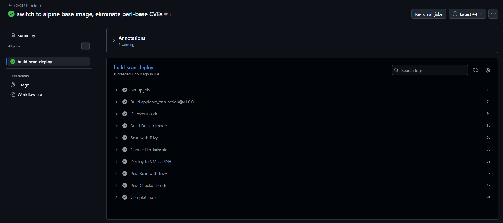

# DevSecOps Portfolio Project

A containerized Python/FastAPI application deployed via a fully automated, security-scanned CI/CD pipeline to a self-hosted Ubuntu Server VM, reachable only over a private Tailscale mesh network.

Built to demonstrate practical DevSecOps skills: infrastructure hardening, container security, automated vulnerability scanning, secrets management, and zero-trust network access, end to end, not just in theory.

---

## Architecture

```
 GitHub Actions (on push to main)
        │
        ▼
 ┌─────────────────┐      ┌──────────────────┐     ┌────────────────────┐
 │  Build Docker   │────▶│  Trivy Security  │────▶│  Tailscale OAuth   │
 │  image          │      │  Scan (CRITICAL) │     │  ephemeral connect │
 └─────────────────┘      └──────────────────┘     └──────────┬─────────┘
                                                              │
                                                              ▼
                                                 ┌─────────────────────────┐
                                                 │  SSH deploy over        │
                                                 │  Tailscale to VM        │
                                                 │  (100.65.181.50)        │
                                                 └───────────┬─────────────┘
                                                             │
                                                             ▼
                                                 ┌─────────────────────────┐
                                                 │  Ubuntu Server 24.04 VM │
                                                 │  UFW + fail2band        │
                                                 │  Docker (non-root user) │
                                                 │  FastAPI on :8000       │
                                                 └─────────────────────────┘
```

No inbound ports are exposed to the public internet. The VM is reachable only via its Tailscale IP, and SSH is restricted to the `tailscale0` interface. The GitHub Actions runner joins the tailnet on-demand as an ephemeral, tagged (`tag:ci`) node for the duration of the deploy step, then disconnects.

---

## Stack

| Layer | Tool |
|---|---|
| Application | Python, FastAPI |
| Containerization | Docker (non-root `appuser`, Alpine base) |
| CI/CD | GitHub Actions |
| Security scanning | Trivy (container image vulnerability scanning) |
| Private networking | Tailscale (OAuth client, tagged ACLs) |
| Host hardening | UFW, fail2ban |
| OS | Ubuntu Server 24.04 (minimized), VirtualBox VM |

---

## Pipeline: Build → Scan → Deploy

On every push to `main`, GitHub Actions runs:

1. **Checkout** — pulls the latest code.
2. **Build** — builds the Docker image from the `Dockerfile`.
3. **Scan (Trivy)** — scans the built image for CRITICAL severity vulnerabilities. The build **fails the pipeline** if any are found with no accepted risk exception — security gate, not just a report.
4. **Connect to Tailscale** — the runner authenticates using a scoped OAuth client (least-privilege: `Auth Keys` write + `Devices:Core` write only) and joins the tailnet as an ephemeral node tagged `tag:ci`.
5. **Deploy** — SSHes into the VM over the private Tailscale network, stops/removes the old container, rebuilds, and starts the new one.

```yaml
# .github/workflows/deploy.yml (excerpt)
- name: Scan with Trivy
  uses: aquasecurity/trivy-action@master
  with:
    image-ref: devsecops-api:latest
    format: table
    exit-code: 1
    severity: CRITICAL
```

---

## Why Trivy?

Trivy was chosen for container image scanning because it:
- Requires no server/database setup — runs as a single binary/action.
- Covers OS package vulnerabilities *and* application dependency vulnerabilities in one scan.
- Integrates natively with GitHub Actions and supports failing the build on a severity threshold, turning scanning into an enforced gate rather than an ignorable report.

During development, Trivy caught a real CRITICAL-severity, unfixed `perl-base` CVE pair (CVE-2026-42496, CVE-2026-8376) inherited from the Debian-based Python image. Since no patched version existed upstream, the base image was switched from `python:3.12-slim` to `python:3.12-alpine`, which doesn't ship `perl-base` at all — eliminating the vulnerable package rather than suppressing the finding.

---

## Security Design Decisions

- **Non-root container user** — the app runs as `appuser`, not root, inside the container.
- **No public inbound ports** — the VM's only reachable interface is Tailscale; SSH is bound to `tailscale0` only.
- **Least-privilege OAuth scoping** — the CI's Tailscale OAuth client is scoped to exactly two capabilities (`Auth Keys: Write`, `Devices:Core: Write`) rather than broad read/write access.
- **Ephemeral CI identity** — the GitHub Actions runner joins the tailnet as a tagged, ephemeral node per run rather than a static, persistent credential.
- **Secrets never touch the repo** — SSH keys, OAuth credentials, and the VM's Tailscale IP are stored exclusively in GitHub Actions encrypted secrets.
- **Fail-closed scanning** — a CRITICAL vulnerability finding stops the deploy; there is no "scan and ignore."

---

## Pipeline Run



---

## Project Structure

```
devsecops-project/
├── main.py
├── Dockerfile
├── requirements.txt
├── .gitignore
├── .dockerignore
└── .github/
    └── workflows/
        └── deploy.yml
```

---

## Local Development

```bash
python -m venv venv
source venv/bin/activate
pip install -r requirements.txt
uvicorn main:app --host 0.0.0.0 --port 8000
```

```bash
docker build -t devsecops-api:latest .
docker run -d -p 8000:8000 --name api devsecops-api:latest
curl http://localhost:8000/health
```

---

## What This Project Demonstrates

- Writing and hardening a REST API and its container image
- Designing a security-gated CI/CD pipeline (not just automation — automation with enforcement)
- Diagnosing and remediating real CVE findings rather than suppressing them
- Zero-trust network design using a mesh VPN instead of public exposure
- Least-privilege credential scoping for CI systems
- Systematic debugging of infrastructure issues (YAML indentation, Linux group permissions, OAuth scope mismatches) under real, messy conditions
